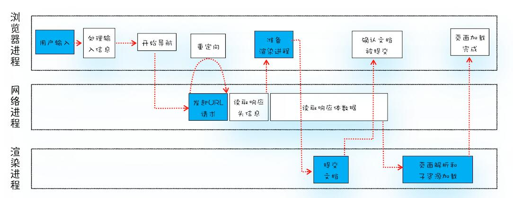
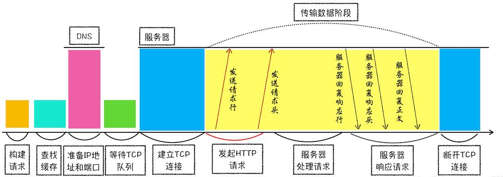
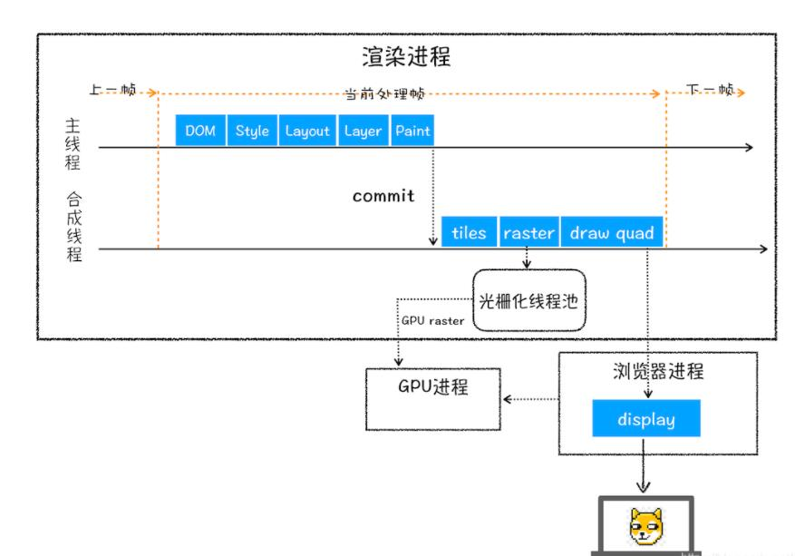

从浏览器地址栏输入 url 开始到页面显示出来的这个过程中，覆盖了前端领域很多知识体系，下面就让我们一起来了解一下吧。

#### 从浏览器不同进程的角度来看，这个过程可分为浏览器进程、网络进程、渲染进程。

##### 一、浏览器进程

- 用户输入内容，进行 URL 解析，看看输入的内容是否符合 URL 规则，解析 URL 提取出协议、域名、端口号，对于一些特殊字符，在传递的时候需要进行编码解码。
- 如果是文本，则拼接成默认搜索引擎加关键字的 URL 进行搜索。
- 如果是 URL 就进行页面访问请求，并加上协议头。

##### 二、网络进程

- URL 符合规则，浏览器进程会通过进程通信将 URL 请求发送给网络进程，网络进程会依次查找 Memory Cache、Disk Cache 中是否有缓存内容，有且没过期则使用，否则则发送网络请求。
- 网络请求第一步就是先进行 DNS 解析，获取请求域名服务器的 IP 地址。

  > 什么是 DNS 解析，每台计算机都有一个唯一 IP 地址，但是 IP 地址不方便记忆，所以采用更方便记忆的网址去查找其他计算机，将网址转换成 IP 地址的过程就是 DNS 解析。

  > 域名解析是一个递归查询 + 迭代查询的过程。
  >
  > - 浏览器缓存，向浏览器的缓存中读取上一次的访问记录
  > - 操作系统的缓存，查找存储在系统运行内存中的缓存
  > - 在 host 文件中查找
  > - 路由器缓存：有些路由器会把访问过的域名存在路由器上
  > - ISP 互联网服务提供商缓存，比如 114.114.114.114
  > - 缓存中找不到，则本地 DNS 服务器进行迭代查询：. 根 DNS 服务器 -> .com 顶级服务器 -> 主域名服务器 -> ...，直到服务器返回对应的 IP

  > DNS 负载均衡：
  > 网站对应的 IP 不止一个，DNS 可以根据每台机器的负载量、距离用户的距离等返回一个合适的服务器 IP 给用户，这个过程就是 DNS 负载均衡，又叫做 DNS 重定向。 CDN 就是利用 DNS 的重定向技术， DNS 会返回一个用户最接近的点的 IP 给用户。

- 拿到 IP 地址发起 HTTP 请求。
- 建立 TCP 三次握手连接, 如果是 HTTPS 建立 TLS 安全通道连接。
- TCP 连接建立之后，浏览器端会构建请求行、 请求头等信息，并把和该域名相关的 Cookie 等数据附加到请求头中，然后向服务器发送构建的请求信息。
- 服务器检查 HTTP 请求头是否包含缓存验证信息进行协商缓存。

  > 协商缓存
  >
  > - Last-Modified 和 If-Modified-Since：
  >   Last_Modified 表示本地文件的最后修改时间，If-Modified-Since 会将 Last-Modified 的值发送给服务器询问该资源是否有更新，如果有更新就会将新的资源发送回来，否则返回 304 状态码，代表资源无更新，继续使用缓存文件。
  >   Last-Modified 弊端：
  >   如果文件只是被打开，没有修改，也会造成 Last-Modified 修改，服务器不能命中缓存。
  >   只能以秒计时，如果在毫秒级的时间内修改了文件，服务器 Last-Modified 的值并不会修改，会返回 304，浏览器就会是自己的缓存。
  > - ETag 和 If-No-Match
  >   ETag 是文件指纹，If-No-Match 会将 ETag 发送给服务器，查询该资源 ETag 是否变动，有变动的话就将新的资源发送回来。ETag 优先级高于 Last-Modified。

  > 状态码
  >
  > - 1xx：指示信息——表示请求已经接受，继续处理
  >   100 Continue 一般在发送 post 请求时，已发送了 http header 之后服务端返回此信息，表示确认，之后发送具体参数信息。
  > - 2xx：成功
  >   200 OK 正常返回信息
  >   201 Created 请求成功并且服务器创建了新的资源
  >   202 Accepted 服务器已接受请求，但尚未处理
  > - 3xx：重定向
  >   301 Moved Permanently 永久重定向
  >   302 Found 临时重定向
  >   303 See Other 临时重定向，且总是使用 GET 请求新的 URI
  >   304 Not Modified 请求内容未改动，走缓存
  > - 4xx：客户端错误
  >   400 Bad Request 服务器无法理解请求格式
  >   401 Unauthorized 请求未授权
  >   403 Forbidden 禁止访问
  >   404 Not Found 找不到与 URI 相匹配的资源
  > - 5xx：服务器错误。
  >   500 Internal Server Error 服务器内部错误
  >   503 Service Unavailable 服务器暂时无法处理请求

- 数据传输完后，如果请求头或响应头里没有 connection: keep-alive，则需要四次挥手断开 TCP 连接，否则会保持连接通道，这样下一次在发送请求，就无需再次 TCP 三次握手了，节省了网络通信时间。

##### 三、渲染进程

- 拿到 HTTP 响应, 页面解析，根据 Content-Type 来判断响应文件类型, stream 类，浏览器启动下载界面下载文件, text、图片类，浏览器直接展示在页面上 , html 类型，浏览器会进行页面解析。
- 网络进程向渲染进程传输 HTML 数据
- 对 HTML 进行词法分析，通过堆栈算法构建 DOM 树。
- 如果遇到外部资源，浏览器会交给网络进程去下载。
- 构建完 DOM 树的同时，将 CSS 代码转为浏览器可以理解的 StyleSheets
- 计算出 DOM 树每个节点的具体样式
- DOM 树构建完成后， 合并 StyleSheets 构建出 CSSOM 渲染树。
- 分层：为节点生成图层
- 绘制：用浏览器指令逐条绘制页面元素。
- 栅格化
- 合成

#### 性能优化

- DNS 优化，DNS 预解析，采用 CDN，DNS 负载均衡；
- 缓存优化，对于静态资源文件实现强缓存和协商缓存,对不经常更新的接口数据采用本地存储做数据缓存，比如地区数据;
- 数据传输优化，服务端开发 GZIP 压缩，一般能压缩 60% 左右；
- 避免 JS 加载阻塞渲染，添加 async、defer 标识，标签放到页面底部；
- 少量首屏样式内联放在标签内；
- 样式结构层次尽量简单；
- 在脚本中尽量减少 DOM 操作，尽量缓存访问 DOM 的样式信息，避免过度触发回流；
- 减少通过 JavaScript 代码修改元素样式，尽量使用修改 class 名方式操作样式或动画；
- 动画尽量使用在绝对定位或固定定位的元素上；
